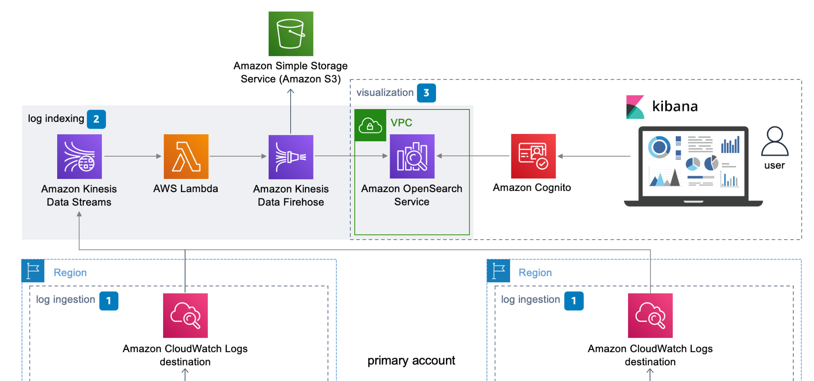

<div id="top"></div>

<!-- PROJECT LOGO -->
<br />
<div align="center">
  <a href="https://github.com/itprosource/terraform-aws-centralized-logging">
  </a>

<h3 align="center">Terraform - Centralized Logging Solution</h3>

  <p align="center">
    Template which deploys an Opensearch/Elasticsearch cluster with Kinesis-based ingest pipeline. Based on AWS-curated <a href="https://aws.amazon.com/solutions/implementations/centralized-logging/">Centralized Logging Solution</a>.
    <br />
  </p>
</div>

<!-- ABOUT THE PROJECT -->



## About The Project
This module deploys a VPC-hosted Opensearch or Elasticsearch cluster as depicted in AWS' Centralized Logging Solution - using Cloudwatch Destinations/Kinesis Data stream to ingest data, pass through a Lambda function which transforms data into Opensearch-readable format, then pipes formatted data through Kinesis Firehose before depositing logs in the Opensearch cluster. Access to Opensearch dashboard is faciliated through an ec2 Bastion host and Cognito user authentication. Includes option for ultrawarm storage. 


### User Management
User accounts are managed in Cognito. Simply go to the user pool to <a href="https://docs.aws.amazon.com/cognito/latest/developerguide/how-to-create-user-accounts.html">add or remove users.</a>

### VPC Security
The cluster is configured to allow external access only through 443 on a bastion host. It is not recommended to leave the dashboard login screen open to the public. Use the bastion host to access the dashboard. Bastion host access rules are controlled in the template. 

### Adding Same-Account Log Stream to Centralized Logging
To add a log stream from the SAME account hosting the Centralized Logging solution, run this command in AWS cli filling in the bracketed values (<>) with your own inputs (make sure to use "aws configure" to first set up cli access to your account): 

```
aws logs put-subscription-filter \
    --log-group-name "<YOUR_LOG_GROUP_NAME>" \
    --filter-name "<YOUR_FILTER_NAME>" \
    --filter-pattern "<YOUR_FILTER_PATTERN>" \
    --destination-arn "arn:aws:kinesis:<YOUR_REGION>:<YOUR_ACCT_#>:stream/<YOUR_STREAM_NAME>" \
    --role-arn "arn:aws:iam::<YOUR_ACCT_#>:role/cw_destination_role-<DOMAIN_NAME>-<UNIQUE_ID>"
```

This command adds the log stream directly to your Kinesis stream. Note: To add all logs with no filtering, leave the quotes blank in --filter-pattern (""). 

### Adding Cross-Account Log Stream to Centralized Logging
To add a cross-account log stream, you will utilize the Cloudwatch Destination which points to your Kinesis stream.

First, you must include the source log account number in your spoke_accounts input so that the local provisioners are able to add the account the Cloudwatch Destination IAM policy allowing log ingestion. 

After the policy has been updated with the account number, run this command in AWS cli with your own inputs for bracketed values (make sure to use "aws configure" to set up cli access to the SOURCE log account beforehand, not the Central Logging account):

```
aws logs put-subscription-filter \
    --log-group-name "<YOUR_LOG_GROUP_NAME>" \
    --filter-name "<YOUR_FILTER_NAME>" \
    --filter-pattern "<YOUR_FILTER_PATTERN>" \
    --destination-arn "arn:aws:logs:<YOUR_REGION>:<YOUR_ACCT_#>:destination:cw_destination_<DOMAIN_NAME>-<UNIQUE_ID>" \
```

If done correctly, you will be able to see the applied destination in the source account under the Subscription Filters tab for the log stream in question.

# Future Updates
As time permits, I plan to work on the following updates:
1. Key Cloudwatch alarms. AWS curates a list of <a href="https://docs.aws.amazon.com/opensearch-service/latest/developerguide/cloudwatch-alarms.html)">best-practice Cloudwatch alarms</a> for monitoring the Opensearch service itself. I would like to add an option for deploying these in the template. 
2. Build out more Opensearch options - Custom Endpoints, Fine-Grained Access Control, etc. 
3. Include demo resources packaged into original AWS Cloudformation template.
4. Include a script to allow mass automated updating of subscription filters, for users with hundreds or even thousands of log streams to add to Central Logging. 
5. Include components and guidance for ingestion of X-ray trace data. 

### Built With

* [Terraform](https://www.terraform.io/)


